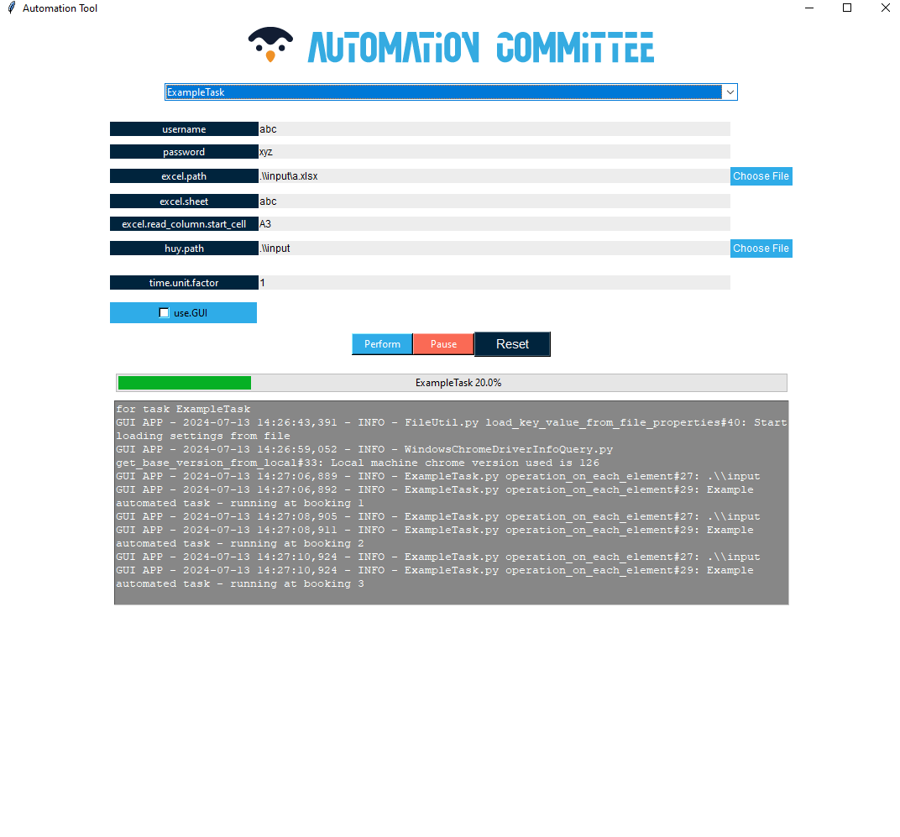

## **Guide for this tool**

Please note that all scripts in this tool are currently written for the user who primarily using Windows.
- Web tasks / arbitrary tasks were supported for both Linux and Windows machine via gui.
- Desktop tasks only work with Windows.

### How to run ?
 
#### Run directly the packaged exe: 
- Run the script dev_pkg_exe
- In the generated dir 'dist', will have an exe for running and an exe for installing

#### Run directly via python interpreter in IDE/dev env: 
- .\start_app gui      (GUI app)
- .\start_app console  (console app, must provide info in InvokedClasses.properties and {task_name}.properties files in /input)

###### After the run, all logs will be stored in `log` These logs may be helpful for investigating any issues we faced during the running process.